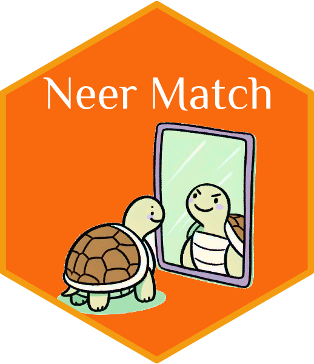

# Neer Match <a href="https://r-neer-match.pikappa.eu"></a>

<!-- badges: start -->


<!-- badges: end -->

The package `neermatch` provides a set of tools for neural-symbolic
entity reasoning and matching. It is designed to support easy set-up,
training, and inference of entity matching models using deep learning,
symbolic learning, and a hybrid approach combining both deep and
symbolic learning. Moreover, the package provides automated fuzzy logic
reasoning (by refutation) functionality that can be used to examine the
significance of particular associations between fields in an entity
matching task.

The project is financially supported by the [Deutsche
Forschungsgemeinschaft](https://www.dfg.de/de) (DFG) under Grant
539465691 as part of the Infrastructure Priority Programme “[New Data
Spaces for the Social Sciences](https://www.new-data-spaces.de/en-us/)”
(SPP 2431).

The package has also an `Python` implementation available at
[py-neer-match](https://github.com/pi-kappa-devel/py-neer-match).

## Features

The package is built on the concept of similarity maps. Similarity maps
are concise representations of potential associations between fields in
two datasets. Entities from two datasets can be matched using one or
more pairs of fields (one from each dataset). Each field pair can have
one or more ways to compute the similarity between the values of the
fields.

Similarity maps are used to automate the construction of entity matching
models and to facilitate the reasoning capabilities of the package. More
details on the concept of similarity maps and an early implementation of
the package’s functionality (without neural-symbolic components) are
given by (Karapanagiotis and Liebald 2023).

The training loops for both deep and symbolic learning models are
implemented in [tensorflow](https://www.tensorflow.org) (see Abadi et
al. 2015). The pure deep learning model inherits from the
[keras](https://keras.io) model class (Chollet et al. 2015). The
neural-symbolic model is implemented using the logic tensor network
([LTN](https://pypi.org/project/ltn/)) framework (Badreddine et al.
2022). Pure neural-symbolic and hybrid models do not inherit directly
from the (Chollet et al. 2015) model class, but they emulate the
behavior by providing custom `compile`, `fit`, `evaluate`, and
`predict`methods, so that all model classes in `neermatch` have a
uniform calling interface.

# Basic Usage

Implementing matching models using `neermatch` is a three-step process:

1.  Instantiate a model with a similarity map.
2.  Compile the model.
3.  Train the model.

To train the model you need to provide three datasets. Two datasets
should contain records representing the entities to be matched. By
convention, the first dataset is called Left and the second dataset is
called Right dataset in the package’s documentation. The third dataset
should contain the ground truth labels for the matching entities. The
ground truth dataset should have two columns, one for the index of the
entity in the Left dataset and one for the index of the entity in the
Right dataset.

``` r
# see also vignette("fuzzy-games") for a more detailed example
library(neermatch)

# 0) replace this with your own data preprocessing function
matching_data <- fuzzy_games_example_data()

# 1) customize according to the fields in your data
similarity_map <- SimilarityMap(
  list(
    title = list("jaro", "levenshtein"),
    `developer~dev` = list("jaro_winkler"),
    year = list("gaussian")
  )
)
model <- NSMatchingModel(similarity_map)

# 2) compile
compile(model)

# 3) train
fit(
  model,
  matching_data$left, matching_data$right, matching_data$matches,
  epochs = 1L, batch_size = 16L
)
#> | Epoch      | BCE        | Recall     | Precision  | F1         | Sat        |
#> | 0          | 6.9980     | 0.1795     | 0.0598     | 0.0897     | 0.7296     |
#> Training finished at Epoch 0 with DL loss 6.9980 and Sat 0.7296
```

# Installation

## From Source

You can obtain the sources for the development version of `neermatch`
from its github
[repository](https://github.com/pi-kappa-devel/r-neer-match).

``` bash
git clone https://github.com/pi-kappa-devel/r-neer-match
```

The installation package can be built using:

``` bash
R CMD build r-neer-match
```

The last command produces a file named `neermatch_<version>.tar.gz`,
where `<version>` is the latest version number of the package. This can
be used to install the package in R as follows:

``` bash
R CMD INSTALL neermatch_<version>.tar.gz
```

# Documentation

Online documentation is available for the
[release](https://r-neer-match.pikappa.eu) and
[in-development](https://r-neer-match.pikappa.eu/dev/) versions of the
package.

## Reproducing Documentation from Source

The README.md file can be created using
[rmarkdown](https://rmarkdown.rstudio.com/).

``` r
rmarkdown::render("README.Rmd", output_format = "md_document")
```

Documentation entries for the package are created using
[roxygen2](https://roxygen2.r-lib.org/index.html) (Wickham, Danenberg,
et al. 2024).

``` r
roxygen2::roxygenize()
```

Finally, the documentaion website uses
[pkgdown](https://pkgdown.r-lib.org/) (Wickham, Hesselberth, et al.
2024).}

``` r
pkgdown::build_site(lazy = TRUE)
```

## Logo

The logo was designed using [Microsoft
Designer](https://designer.microsoft.com/) and [GNU Image Manipulation
Program (GIMP)](https://www.gimp.org/). The hexagon version of the logo
was generated with the R package
[hexSticker](https://github.com/GuangchuangYu/hexSticker). It uses the
[Philosopher](https://fonts.google.com/specimen/Philosopher) font.

# Alternative Software

TODO

# Contributors

[Pantelis Karapanagiotis](https://www.pikappa.eu) (maintainer)

[Marius Liebald](https://www.marius-liebald.de) (contributor)

Feel free to share, modify, and distribute. If you implement new
features that might be of general interest, please consider contributing
them back to the project.

# License

The package is distributed under the [MIT license](LICENSE.md).

# References

<div id="refs" class="references csl-bib-body hanging-indent"
entry-spacing="0">

<div id="ref-tensorflow2015" class="csl-entry">

Abadi, Martín, Ashish Agarwal, Paul Barham, Eugene Brevdo, Zhifeng Chen,
Craig Citro, Greg S. Corrado, et al. 2015. “TensorFlow: Large-Scale
Machine Learning on Heterogeneous Systems.”
<https://www.tensorflow.org/>.

</div>

<div id="ref-badreddine2022logic" class="csl-entry">

Badreddine, Samy, Artur d’Avila Garcez, Luciano Serafini, and Michael
Spranger. 2022. “Logic Tensor Networks.” *Artificial Intelligence* 303:
103649. <https://doi.org/10.1016/j.artint.2021.103649>.

</div>

<div id="ref-keras2015" class="csl-entry">

Chollet, François et al. 2015. “Keras.” <https://keras.io>.

</div>

<div id="ref-karapanagiotis2023" class="csl-entry">

Karapanagiotis, Pantelis, and Marius Liebald. 2023. “Entity Matching
with Similarity Encoding: A Supervised Learning Recommendation Framework
for Linking (Big) Data.” <http://dx.doi.org/10.2139/ssrn.4541376>.

</div>

<div id="ref-roxygen22024" class="csl-entry">

Wickham, Hadley, Peter Danenberg, Gábor Csárdi, and Manuel Eugster.
2024. “Roxygen2: In-Line Documentation for r.”
<https://roxygen2.r-lib.org/>.

</div>

<div id="ref-pkgdown2024" class="csl-entry">

Wickham, Hadley, Jay Hesselberth, Maëlle Salmon, Olivier Roy, and Salim
Brüggemann. 2024. “Pkgdown: Make Static HTML Documentation for a
Package.” <https://pkgdown.r-lib.org/>.

</div>

</div>
